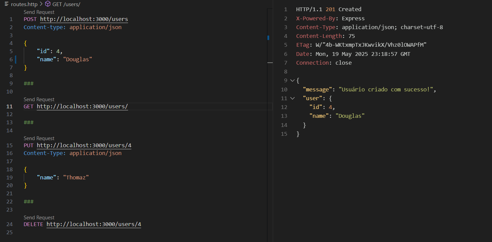

# **API REST Simples com Express e Node.js**

## **1. Para rodar o projeto**

```bash
git clone github.com/chaotzdud/express-api
npm install
npm run dev
```

## **2. Endpoints**

### **POST /users**

```bash
HTTP/1.1 201 Created
X-Powered-By: Express
Content-Type: application/json; charset=utf-8
Content-Length: 75
ETag: W/"4b-WKtxmpTxJKwvikX/Vhz0lOWAPfM"
Date: Mon, 19 May 2025 23:15:14 GMT
Connection: close

{
  "message": "Usuário criado com sucesso!",
  "user": {
    "id": 4,
    "name": "Douglas"
  }
}
```

### **GET /users**

```bash
HTTP/1.1 200 OK
X-Powered-By: Express
Content-Type: application/json; charset=utf-8
Content-Length: 102
ETag: W/"66-+QAU9BxtF4hpTwhhUTuWWTeo9CI"
Date: Mon, 19 May 2025 22:53:10 GMT
Connection: close

[
  {
    "id": 1,
    "name": "Eduarda"
  },
  {
    "id": 2,
    "name": "Jorge"
  },
  {
    "id": 3,
    "name": "Carlos"
  },
  {
    "id": 4,
    "name": "Douglas"
  }
]
```

### **GET /users/:id**

```bash
HTTP/1.1 200 OK
X-Powered-By: Express
Content-Type: application/json; charset=utf-8
Content-Length: 24
ETag: W/"18-pT1b/Q7UefVZNMdiqW/wxYUE8rg"
Date: Mon, 19 May 2025 22:54:22 GMT
Connection: close

{
  "id": 4,
  "name": "Douglas"
}
```

### **PUT /users/:id**

```bash
HTTP/1.1 200 OK
X-Powered-By: Express
Content-Type: application/json; charset=utf-8
Content-Length: 78
ETag: W/"4e-Jd0lWaQ0eP9fThK4rv0DQzZ05K0"
Date: Mon, 19 May 2025 23:13:22 GMT
Connection: close

{
  "message": "Usuário atualizado com sucesso!",
  "user": {
    "id": 4,
    "name": "Thomaz"
  }
}
```

### **DELETE /users/:id**

```bash
HTTP/1.1 200 OK
X-Powered-By: Express
Content-Type: application/json; charset=utf-8
Content-Length: 75
ETag: W/"4b-vpJWnb9i3G5yYCqlDw9locUN6zk"
Date: Mon, 19 May 2025 22:54:35 GMT
Connection: close

{
  "message": "Usuário removido com sucesso",
  "user": {
    "id": 4,
    "name": "Thomaz"
  }
}
```

## **3. Testes de API**

- No repositório deste projeto, há um arquivo chamado [routes.http](./routes.http)
- Para executá-lo da maneira mais simples possível, utilize a extensão REST Cliente do Visual Studio Code.
- Ao acessar o arquivo mencionado, há os *Requests* para cada um dos endpoints mencionados

